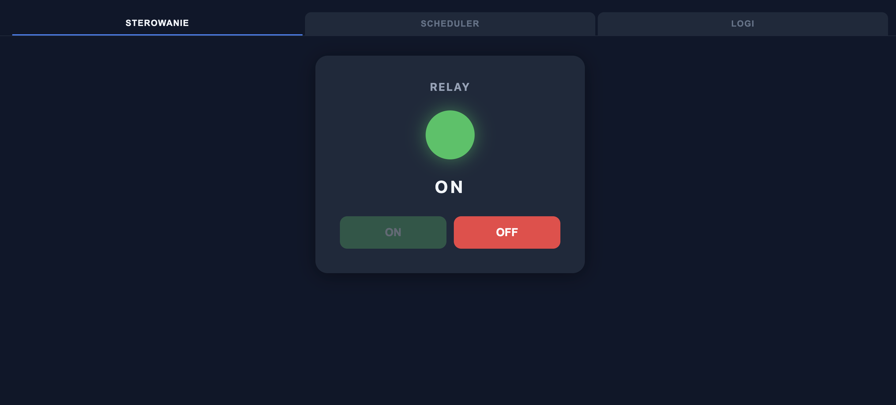
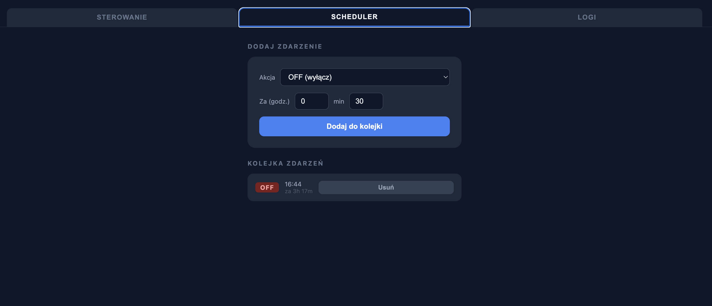
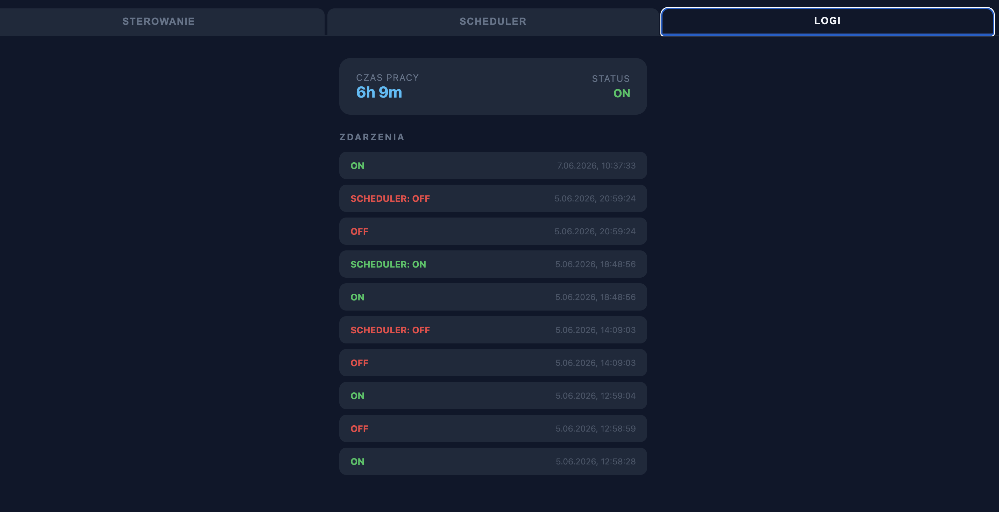

# remote-onoff

A web-based relay controller running on Raspberry Pi. Lets you switch a GPIO-connected relay on and off from any browser on the local network, schedule timed actions, and review a full event log.

## What it does

- **Manual control** — turn the relay ON or OFF instantly from the browser
- **Scheduler** — queue future ON/OFF actions by specifying a delay (hours + minutes); jobs fire automatically and can be cancelled before they run
- **Logs** — view a timestamped history of every state change (manual and scheduled) along with total uptime

## Tech stack

| Layer | Technology |
|---|---|
| Runtime | Node.js |
| Server | Express 4 |
| GPIO | pigpio (libpigpio wrapper for Raspberry Pi) |
| Hardware | SSR-40DA solid-state relay on GPIO pin 17 (active-high) |
| Frontend | Vanilla HTML/CSS/JS served as static files |

## Screenshots

### Control panel



### Scheduler



### Logs



## Running

```bash
npm install
npm start
```

The server listens on `0.0.0.0:3000`. Open `http://<raspberry-pi-ip>:3000` in a browser.

> Requires `pigpio` and its native dependencies — must run on a Raspberry Pi with the pigpio C library installed.
